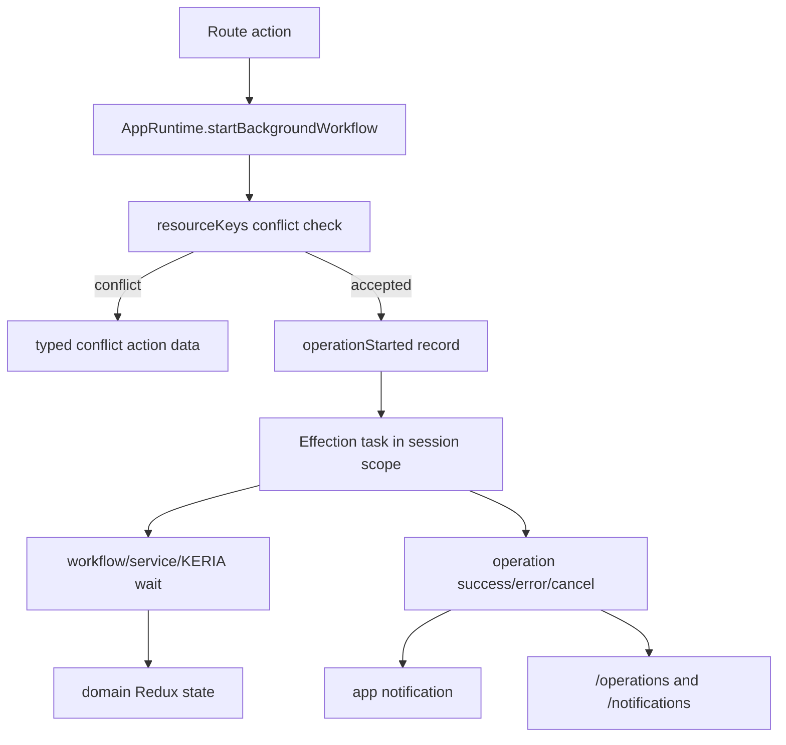

# Background Operations And App Notifications

This document explains the app's non-blocking operation model, app-level
notifications, operation history routes, and shell indicators. Use it when
moving KERIA work out of a blocking route action or when adding user-visible
completion/failure feedback for long-running work.

## Mental Model

The app has two workflow launch paths:

| Path | Runtime API | UX contract | Examples |
| --- | --- | --- | --- |
| Foreground | `AppRuntime.runWorkflow(...)` | The user is blocked by route loading, a fetcher submission, or the global loading overlay until work finishes. | Connect, passcode generation, route loader reads. |
| Background | `AppRuntime.startBackgroundWorkflow(...)` | The route action returns immediately with accepted/conflict metadata while Effection watches the KERIA work in the session scope. | Identifier create and rotate. |

Foreground work is still correct when the app cannot proceed without the
result. Background work is correct when the user can keep navigating while the
operation finishes and can inspect progress or completion later.

Top-level background handoff belongs in `AppRuntime`. Use Effection `spawn`
inside a workflow only for true child concurrency within one unit of work. Do
not start top-level background tasks directly from React components or services;
that bypasses operation tracking, conflict checks, and notifications.

## Operation Records

`src/state/operations.slice.ts` stores serializable operation facts. These
records power active-operation indicators, operation history, detail pages,
conflict guards, and persistence.

Important fields:

| Field | Purpose |
| --- | --- |
| `requestId` | Correlation key shared by route action response, operation detail route, and app notification. |
| `kind` | Machine-readable operation category. Add a typed kind before wiring new workflow families. |
| `phase` | Human-readable current phase. Today most flows use lifecycle status; future workflows can update finer phases. |
| `resourceKeys` | Optimistic concurrency keys used to reject or disable conflicting work. |
| `operationRoute` | Link to `/operations/:requestId`. |
| `resultRoute` | Optional link to the operation-specific success context. |
| `notificationId` | Back-reference to the app notification created for background completion/failure. |
| `keriaOperationName` | Optional raw KERIA operation name for diagnostics, never the raw operation object. |

Redux must stay serializable. Do not store `Task`, `SignifyClient`, raw KERIA
operation responses, `Error`, `AbortController`, DOM nodes, or Promise objects
in any state slice.

## Conflict Guarding

Each background operation should declare resource keys before launch. The
runtime rejects a new background task when a running operation owns any of the
same keys.

Current keys:

- Identifier create: `identifier:name:<name>`
- Identifier rotate: `identifier:aid:<aid-or-alias>`

Expected future keys:

- Contact resolution: `contact:<alias>`
- Schema resolution: `schema:<said>`
- Registry creation: `registry:issuer:<aid>`
- Credential flows: `credential:<said>`

The UI should disable only the conflicting action, not the whole app. For
example, rotating one identifier should disable only that identifier's rotate
button while allowing navigation and other non-conflicting actions.

## App Notifications

`src/state/appNotifications.slice.ts` is the user-facing notification system for
app work. It is separate from `src/state/notifications.slice.ts`, which tracks
KERIA notification inventory and processing status.

An app notification is created by `AppRuntime.recordCompletionNotification(...)`
when a background task completes successfully or fails and the launch options
provide a notification template.

Notification links:

- `operation`: required link to `/operations/:requestId`.
- `result`: optional link to the operation-specific result route.

Notification read behavior:

- The bell popover in `TopBar` marks visible unread notifications as read after
  1250 ms.
- The `/notifications` route also marks unread notifications as read after
  1250 ms.
- `selectAppNotifications` returns notifications in descending `createdAt`
  order.

## Shell And Routes

The app shell exposes background work through:

- `TopBar` operation indicator: active count and popover of running operations.
- `TopBar` notification bell: unread count and recent app notifications.
- `/operations`: reverse-chronological operation history.
- `/operations/:requestId`: operation detail with lifecycle fields and links.
- `/notifications`: app notification list.

Operations and notifications routes have no connection gate. Persisted history
must remain visible after disconnect or refresh.

The global `LoadingOverlay` is for foreground work only: connect, passcode
generation, route navigation, and loader/fetcher pending state. Background
operations must not trigger the blocking overlay.

## Adding A Background Flow

1. Add a typed `OperationKind`.
2. Define resource keys before launch.
3. Add or extend an Effection service operation for Signify/KERIA calls.
4. Add a workflow that composes services and dispatches domain Redux state.
5. Add `AppRuntime.startX(...)` using `startBackgroundWorkflow(...)`.
6. Provide title, description, result route, and success/failure notification
   templates.
7. Wire the route action to return accepted/conflict metadata immediately.
8. Use selectors to disable only conflicting UI actions.
9. Add reducer/runtime/route-data tests and a smoke check for the visible UX.

Do not add a background path without a conflict key unless the operation truly
cannot conflict with any other valid user action.
