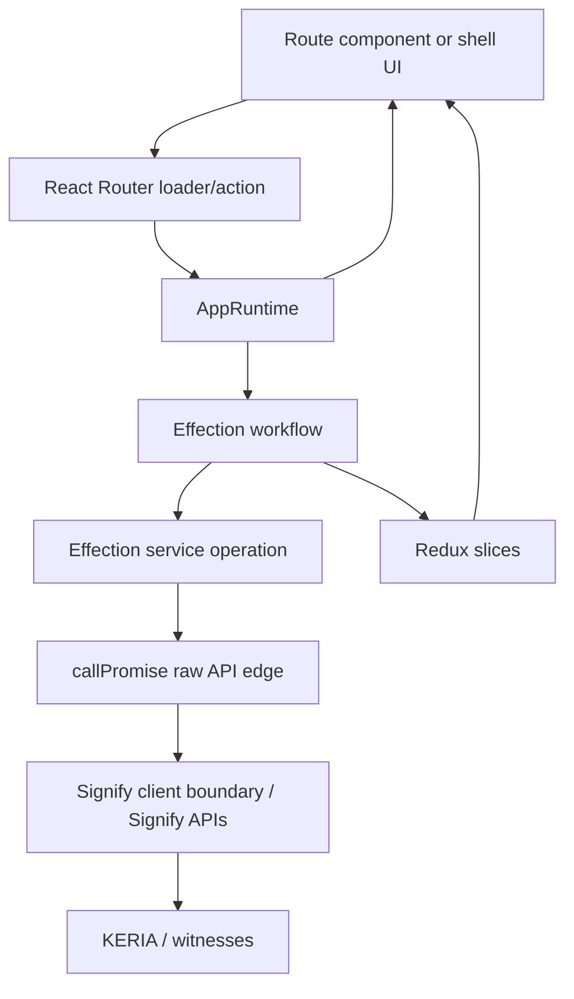

# Workflow And State Architecture

This document explains the app's service, workflow, and Redux state layers. Use
it when adding KERIA behavior that needs progress tracking, cancellation,
shared state, or route integration.

## Mental Model

The architecture has four layers:

| Layer | Location | Responsibility |
| --- | --- | --- |
| Boundary | `src/signify/client.ts` | Owns `signify-ts` readiness, client construction, KERIA boot/connect, state reads, operation waits, timeouts, and logging hooks. |
| Services | `src/services/*.service.ts` | Effection service operations for Signify/KERIA use cases. Services compose raw Promise API calls through small `callPromise` edges, but do not dispatch Redux actions. |
| Workflows | `src/workflows/*.op.ts` | Effection operations that orchestrate services, handle route aborts, and dispatch Redux state changes. |
| State | `src/state/*.slice.ts` | Serializable Redux projections for session, operations, identifiers, contacts, challenges, credentials, schemas, registries, roles, and notifications. |

React Router talks to `AppRuntime`. `AppRuntime` launches workflows and exposes
Promise-returning methods to loaders/actions. Components render route data and
Redux-derived shell state; they do not construct Signify clients or call
`signify-ts` directly.

## Runtime And Effection

`src/app/runtime.ts` is the bridge between React Router's Promise-facing API and
Effection's operation model. Public runtime methods such as `connect`,
`listIdentifiers`, and `createIdentifier` call `runWorkflow`.

`runWorkflow` is responsible for:

- creating or accepting a stable `requestId`,
- dispatching operation lifecycle records when tracking is enabled,
- running the Effection operation in the app or session scope,
- wiring React Router abort signals into `task.halt()`,
- reporting success, failure, or cancellation to `state.operations`.

Use `scope: "app"` for work that may run before or outside a KERIA session,
such as passcode generation or initial connect. Use the default session scope
for work that must be halted on disconnect or reconnect.

`src/effects/scope.ts` owns those lifetimes:

- app scope: created once with the browser runtime,
- session scope: recreated after successful connect,
- disconnect/reconnect: halts session-scoped work.

## Services

Services are Effection operations because they are the first composable unit
around Signify/KERIA behavior. A service may:

- call raw Signify/KERIA Promise APIs through `callPromise`,
- call `src/signify/client.ts` boundary functions through `callPromise`,
- wait for KERIA operations through `waitOperationService`,
- compose other service operations with `yield*`,
- return normalized data.

A service must not:

- dispatch Redux actions,
- read React Router state,
- mutate React component state,
- decide whether a workflow is tracked in the operation history.

This keeps services reusable and cancellation-aware while preserving a strict
boundary: raw Promises exist only at API edges, and app-owned multi-step work is
modeled as Effection operations.

## Workflows

Workflows are Effection generator operations under `src/workflows`. They are the
unit-of-work layer. A workflow may:

- read capabilities from `AppServicesContext`,
- compose service operations with `yield*`,
- dispatch Redux actions before or after a service call,
- return data back to `AppRuntime`.

Workflows should not manually thread abort signals into services. Service
operations that need cancellation, such as `waitOperationService`, read the
current Effection abort signal themselves.

Workflows should keep business inputs explicit in parameters. Do not hide
workflow inputs in global state just because the workflow can read the Redux
store.

Current workflow groups:

- `signify.op.ts`: Signify readiness, passcode generation, boot/connect, state
  refresh, and generic KERIA operation waits.
- `identifiers.op.ts`: list/create/rotate identifier flows and identifier
  slice updates.
- `domain.op.ts`: documented placeholders for future contact, challenge,
  notification, schema, registry, and credential workflows.

The placeholder operations in `domain.op.ts` are intentional architecture
anchors. They define inputs and state transitions that future implementation
should fill in instead of inventing parallel entry points.

## Redux State

Redux state is a serializable projection of workflow progress and domain
resources. It is not the owner of raw Signify clients. Raw clients stay in
`AppRuntime` connected state.

State slices:

| Slice | Purpose |
| --- | --- |
| `session` | Serializable connection state: status, boot flag, controller AID, agent AID, error, connected time. |
| `operations` | Runtime workflow lifecycle records for pending overlays, diagnostics, cancellation, and history. |
| `identifiers` | Normalized identifier inventory and last identifier mutation. |
| `contacts` | OOBI/contact resolution records. |
| `challenges` | Challenge/response exchange records. |
| `credentials` | Credential summary records by SAID. |
| `notifications` | Notification route processing status. |
| `schema` | Credential schema resolution records. |
| `registry` | Issuer registry records. |
| `roles` | Local issuer/holder/verifier role bindings. |

Selectors in `src/state/selectors.ts` are the preferred read API. Add selectors
when a component or workflow needs a derived view of state; do not duplicate
derivation in components.

## Adding A New KERIA Flow

Use this order:

1. Add or extend the Signify boundary only if the flow needs a reusable
   lifecycle primitive.
2. Add an Effection service operation for the Signify/KERIA API calls and
   operation waits.
3. Add or update Redux slice records for durable, serializable progress.
4. Add an Effection workflow that calls the service and dispatches slice
   actions.
5. Add an `AppRuntime` method if React Router loaders/actions need the flow.
6. Add route loader/action wiring and UI rendering.
7. Add unit tests for parsing/reducers/runtime workflow behavior.
8. Add scenario tests only when the flow must prove real KERIA behavior.

If a value is app/runtime configuration, add it to `src/config.ts`. If it is an
optional external fixture only needed by Vitest, add it to
`tests/support/config.ts`.

## Documentation Standard

Each new exported function, type, slice, workflow operation, and significant
internal helper should have a short intent comment. The comment should answer:

- Why does this abstraction exist?
- Which layer owns this responsibility?
- What future change should not bypass it?

Do not add comments that merely restate syntax. Prefer comments that preserve
the boundary decision for the next maintainer.
